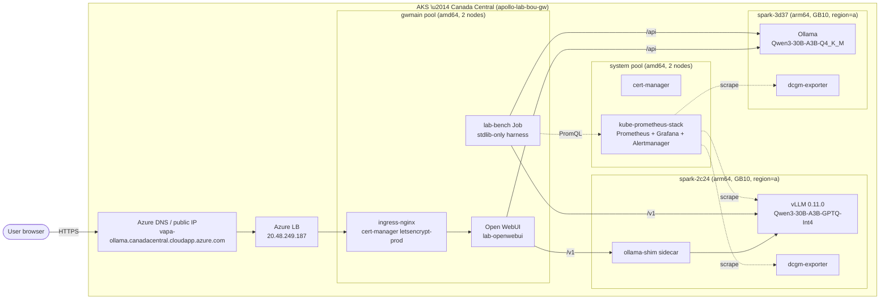

# Wave 1 architecture

Snapshot of what's deployed at the close of Wave 1. AKS Canada Central +
two DGX Sparks (Region A) running Qwen3-30B-A3B behind a public Open WebUI.

## Topology

## First-party Microsoft surfaces in scope today

| Surface              | Status     | Notes                                              |
|----------------------|------------|----------------------------------------------------|
| AKS                  | live       | apollo-lab-bou-gw, system + gwmain pools           |
| Azure Load Balancer  | live       | fronts ingress-nginx                               |
| Azure DNS            | live       | `*.canadacentral.cloudapp.azure.com`               |
| Managed Identity     | partial    | kubelet identity for ACR pull (Wave 2)             |
| ACR                  | planned    | Wave 2 \u2014 mirror vllm/ollama/openwebui images  |
| Front Door           | planned    | Wave 3 \u2014 multi-region terminate + WAF          |
| Azure Blob (xfer)    | planned    | Wave 2 \u2014 weights staging for non-HF mirrors    |
| Workload Identity    | planned    | Wave 2 \u2014 federated creds for HF/Blob pulls     |

## Persistence

| Node       | Volume     | Backed by                | Used for                                |
|------------|------------|--------------------------|-----------------------------------------|
| spark-3d37 | local PVC  | local-path (XFS)         | Ollama models + Modelfiles              |
| spark-2c24 | local PVC  | local-path (XFS)         | vLLM HF cache (Qwen GPTQ-Int4)          |
| gwmain     | Azure Disk | managed-csi              | Open WebUI sqlite + uploads             |
| gwmain     | Azure Disk | managed-csi              | Prometheus TSDB + Grafana state         |

## Key flows

- **User chat**: browser \u2192 Azure LB \u2192 ingress-nginx \u2192 Open WebUI \u2192
  (vLLM via shim) or (Ollama directly) \u2192 stream tokens back.
- **Bench**: in-cluster Job pod \u2192 vLLM/Ollama HTTP \u2192 results JSON to PVC \u2192
  `make w1.6-results-fetch` to host. Phase windows queried back from
  Prometheus for peak GPU power.
- **Observability**: dcgm-exporter (DaemonSet, GPU nodes only) +
  vLLM `/metrics` \u2192 Prometheus (static scrape configs) \u2192 Grafana
  dashboards under `lab-observability`.

See [glossary](../GLOSSARY.md) for engine/namespace/label canon and
[wave-1-state.md](wave-1-state.md) for endpoint/PVC inventory.
