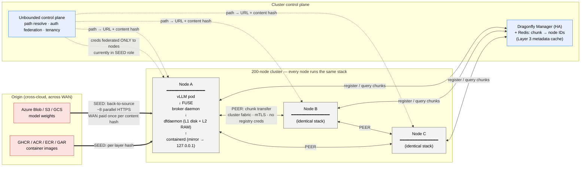
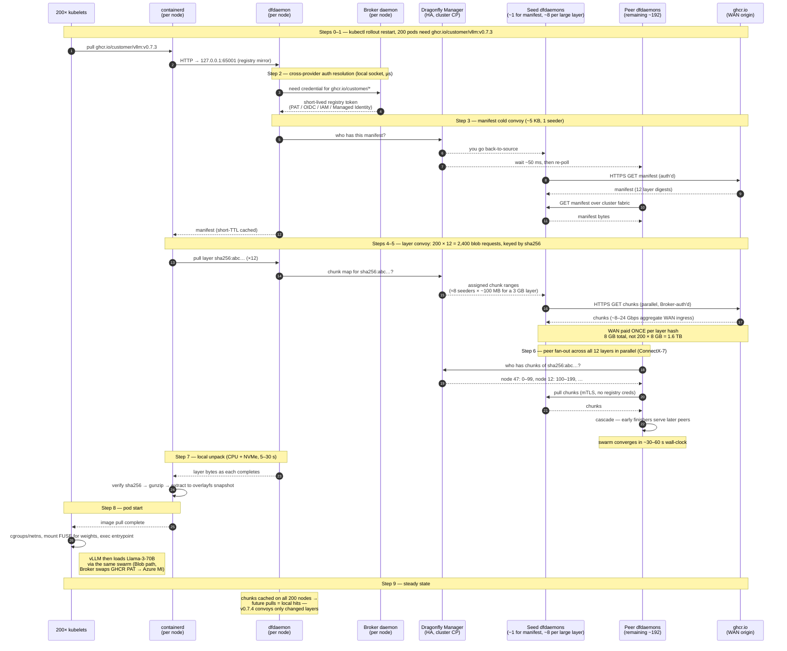

# Efficient Model Image Pulling at scale

Modern AI infrastructure has a fundamental data-movement problem that gets worse as it scales. A single training or inference job needs identical bytes — model weights in the tens to hundreds of gigabytes, container images with embedded CUDA stacks at multiple gigabytes, training datasets reaching into the terabytes — landed on every GPU node that participates in the job. With hundreds or thousands of nodes per cluster, that means the same bytes need to arrive at every node fast enough that GPUs costing dollars per hour aren't sitting idle waiting for a network fetch. The bytes typically live at a remote origin: a public model hub like HuggingFace, a customer's object store in some cloud region, or a container registry. The naive approach — every node pulls from the origin independently — fails in two predictable ways. First, no origin can serve hundreds of concurrent connections at the throughput each one wants; the origin saturates, throttles, or rate-limits, and the convoy stretches from minutes into hours while pulls fail and retry. Second, even if the origin could serve everyone, the customer is leaving the cluster's own internal network on the floor — fast intra-datacenter bandwidth that's orders of magnitude greater in aggregate than any single origin connection, idle while every node serializes through the same external pipe. Unbounded Storage is built around the observation that this problem has a clean physical answer: bytes should cross from origin into the datacenter exactly once per content version, regardless of fleet size, and the cluster's own network should do the heavy lifting of getting those bytes from one node to many. The architecture is the implementation of that observation.

The architecture has three cleanly separated layers:

1. A customer-facing surface (FUSE mounts, S3-compatible API, registry mirror) that exposes whatever interface the workload expects.
2. A broker daemon on each node that handles cross-provider authentication, path-to-content-hash resolution, and tenant isolation, abstracting away the differences between Azure Blob, S3, GCS, GHCR, ECR, and on-prem sources.
3. Dragonfly underneath as the peer-to-peer distribution substrate, with a small HA Manager coordinating cold convoys and per-node `dfdaemon` processes running a content-addressed cache and serving chunks to peers over the cluster network.

The motivating insight is that bytes should cross from origin into the datacenter exactly once per content version regardless of fleet size, and that peer fan-out is the only architecture that converts fleet size from a liability (more nodes = more origin pulls, more rate-limit pressure, longer convoys) into an asset (more nodes = more peers serving each other). Dragonfly handles the substrate problem that's already been solved well by others; the broker daemon and the surfaces above are where the engineering effort goes — the cross-provider auth abstraction, multi-tenancy, write-back path, and Kubernetes-native orchestration deliver the actual product differentiation. 

 
 

# Limitation
The design is its v1 incarnation relies on TCP transport with RDMA as a follow-up, no lazy-pull optimization, single-cluster, single-tenant scope — and treats those as known next steps rather than capabilities to overpromise.

# Scenario 1: Pulling Container Images on every baremetal machine

Imagine a 200-node bare-metal AI cluster in one datacenter, ConnectX-7 fabric between nodes. The customer is rolling out 200 replicas of vLLM serving Llama-3-70B. The vLLM container image lives in their private registry — say `ghcr.io/customer/vllm:v0.7.3` — and weighs about 8 GB compressed (CUDA libraries, PyTorch, vLLM, system dependencies; weights are not in the image, they're loaded separately as in the Blob walkthrough).

The customer kicks off `kubectl rollout restart deployment/vllm-llama-70b`, and 200 pods need to start across 200 nodes. None of those nodes have ever pulled this image before — it's a brand-new tag.

### Step 0: The starting condition

The image consists of a **manifest** (a small JSON document, ~5 KB) and ~12 **layers** (the tar archives that make up the filesystem, totaling ~8 GB compressed). Each layer is content-addressed in the registry by SHA256: `sha256:abc123...`. Layers are immutable; the same layer can be referenced by many image tags.

Each node runs:
- The broker daemon (a DaemonSet)
- Dragonfly's `dfdaemon` (also a DaemonSet, deployed alongside)
- containerd, configured to use the local dfdaemon as a registry mirror
- Whatever GPU workloads the customer has scheduled

Somewhere in the cluster, a Dragonfly Manager runs as a Deployment with 3 replicas for HA. This is the coordinator. It knows nothing yet about `vllm:v0.7.3`.

The customer has previously configured an broker `RegistrySource` CRD pointing at `ghcr.io/customer/*` with their GitHub Personal Access Token (or whatever credential GHCR requires). This sits in the broker auth abstraction alongside their Azure Blob credentials, GCS service account, and on-prem registry credentials. The customer authenticates to *broker* once; broker handles the per-registry credential dance.

The customer kicks off `kubectl rollout restart`. The deployment controller creates 200 new pods. The scheduler places them across 200 nodes. Within a window of maybe 100 milliseconds, 200 kubelets all see "I need to start a pod with image `ghcr.io/customer/vllm:v0.7.3`."

### Step 1: 200 kubelets simultaneously try to pull

Each kubelet asks its local containerd: "pull this image." Containerd checks: do I have any of its layers locally? No (brand new tag). It needs to fetch the manifest and any missing layers.

Containerd's HTTP request for the manifest goes to `ghcr.io/customer/vllm:v0.7.3` — but its mirror config redirects this to `127.0.0.1:65001`, the local dfdaemon. So all 200 kubelets are now talking to their local dfdaemons, asking for the manifest.

**Physics happening here:** none yet. Localhost HTTP requests, no bytes moving on the wire. The 200 simultaneous pulls have just been collapsed from "200 pulls hitting ghcr.io" to "200 pulls hitting 200 local processes."

### Step 2: Auth resolution and registry credential setup

Each dfdaemon receives a request: "give me the manifest for `ghcr.io/customer/vllm:v0.7.3`." Before it can fetch from origin, it needs registry credentials.

This is where the broker daemon comes in. The dfdaemon queries the broker daemon over a local socket: "I need to authenticate to `ghcr.io/customer/*`. Give me a credential." The broker daemon looks up the customer's configured `RegistrySource`, retrieves the PAT (or generates a short-lived token, depending on registry type), and hands it to the dfdaemon.

For other registry types this lookup looks different but the boundary is the same: AWS IAM credentials for ECR, GCP workload identity federation for GAR, Azure managed identity for ACR. The customer doesn't configure any of this on each node; they configure it once in broker's auth layer, and the broker daemon federates per-registry credentials to dfdaemons on demand.

This matters most for the seed dfdaemons (the ones that will reach back-to-source). Peer-to-peer transfers between dfdaemons within the cluster don't need registry credentials — they're authenticated by cluster identity, not by registry identity. The customer's GHCR PAT is exposed to a small number of dfdaemons during seed, not to every node.

**Physics happening here:** local socket calls, microseconds. Not on the critical path. But this is the load-bearing piece for the cross-provider story: a single customer with images in three different registries on three different clouds works without per-node credential plumbing.

### Step 3: Manifest fetch — the cold convoy in miniature

Each dfdaemon, now equipped with registry credentials, queries the Manager: "anyone have this manifest? If not, can I be the one to fetch it?"

The Manager receives 200 simultaneous queries within milliseconds. Same scheduling decision as the Blob case: it picks one (or a small number, default 1 for a manifest since manifests are tiny) of the 200 dfdaemons as the back-to-source node. Tells the rest: "wait briefly, then ask again."

The chosen dfdaemon — call it node 47 — opens an HTTPS connection to `ghcr.io`, authenticated with the credential it just received from the broker daemon. Pulls the 5 KB manifest. Done in milliseconds.

The other 199 dfdaemons poll the Manager again ~50 ms later. Manager responds: "node 47 has it." They open HTTP connections to node 47's dfdaemon over the cluster fabric, pull the 5 KB manifest, cache it locally.

**Physics happening here:** ghcr.io served exactly one manifest fetch instead of 200. WAN egress = 5 KB, not 1 MB. Trivial in absolute terms but illustrates the pattern that scales.

The manifest is short-TTL cacheable: if the customer pushes a new image to the same tag tomorrow, the manifest changes (same tag, different content hash list). Dragonfly caches manifests with a short TTL (minutes) so tag updates propagate quickly without a re-pull every time.

Each dfdaemon returns the manifest to its containerd. Containerd parses the manifest, sees the list of 12 layer digests, and starts pulling each layer.

### Step 4: Layers — the actual fan-out problem

Now the same dance, but for 12 layers totaling 8 GB. This is where the bytes are.

Each containerd issues 12 layer-blob requests to its local dfdaemon. So 200 nodes × 12 layers = 2,400 simultaneous blob requests across all the dfdaemons. Each dfdaemon, for each layer, queries the Manager.

The shape of this matters: **layers are content-addressed by SHA256**. The manifest references each layer by its hash, e.g. `sha256:a1b2c3...`. The Manager's chunk-tracking is keyed on these hashes. So when 200 dfdaemons all ask about `sha256:a1b2c3...`, the Manager understands they're all asking about the same bytes.

The Manager's scheduling, per layer:

For a small layer (say, a 50 MB Python dependency layer), the Manager picks 1-2 nodes as seeders and tells them to back-to-source. The rest queue.

For a large layer (say, the 3 GB CUDA layer), the Manager applies chunk-level scheduling. The 3 GB layer gets split into chunks (default 4 MB, so ~750 chunks). The Manager assigns chunk ranges to multiple seeders — maybe 8 nodes, each fetching 100 MB worth of chunks from ghcr.io in parallel.

Same logic as the Blob case, applied per-layer. And same auth path: each seed dfdaemon checks with the local broker daemon for the right registry credential before opening its connection to ghcr.io.

### Step 5: Bytes cross the WAN, exactly once per layer

The chosen seed nodes open HTTPS connections to `ghcr.io` (or whatever blob storage the registry redirects to — GHCR uses Azure Blob behind the scenes, ECR uses S3, etc.). They fetch their assigned chunks, authenticated by the credentials broker provided.

For our 8 GB image with 12 layers and ~8 seeders per large layer:
- WAN egress total: **8 GB once**, parallelized across ~8 connections per layer
- Connection pattern: small concurrent HTTPS streams from the datacenter, each pulling at most 1 GB
- ghcr.io's NIC sees a handful of connections, not 200

Throughput per connection from ghcr.io is typically 1-3 Gbps sustained. Aggregate: 8-24 Gbps of WAN ingress. Wall-clock for the WAN phase: 5-20 seconds for the full image, depending on link conditions.

Each seed dfdaemon writes the chunks it receives to local disk in a content-addressed cache, keyed by `(layer_sha256, chunk_offset)`.

**Physics happening here:** WAN bytes flowing in, paid once. From this point forward, no byte will cross the WAN for this image again until a new tag with a different layer hash is pushed.

### Step 6: Peer fan-out, simultaneously across all 12 layers

While the seeders are still pulling from ghcr.io, the ~192 non-seeder dfdaemons are polling the Manager: "any peers have chunks I need?"

Within seconds, the Manager starts responding "yes, node 47 has chunks 0-99 of layer `sha256:a1b2c3...`." The non-seeder dfdaemons open connections to seeder dfdaemons over the cluster fabric and start pulling chunks.

This happens **per chunk, per layer, simultaneously across all 12 layers**. A given dfdaemon might be:
- Pulling chunks of layer 1 from node 47
- Pulling chunks of layer 2 from node 12
- Pulling chunks of layer 3 from node 88 (which got them from node 23 thirty seconds ago)
- Serving chunks of layer 4 to nodes 102, 103, 104 because it finished those chunks early
- Serving chunks of layer 7 to nodes 55, 199

The cluster fabric lights up with concurrent peer-to-peer transfers in all directions. Each dfdaemon is both consumer and producer for different layers at different times. Per-connection throughput around 50-80 Gbps on the ConnectX-7 fabric over HTTP/TCP, with many concurrent connections per dfdaemon.

**Physics happening here:** the fabric has converted "12 layers from origin" into "12 layers landing on 200 nodes" via cascading peer copies. The propagation pattern looks like a bunch of trees doubling at each generation, one per layer, all running in parallel.

These peer-to-peer transfers carry no registry credentials. The dfdaemon-to-dfdaemon channel is authenticated by cluster identity (mTLS within the dfdaemon mesh), and tenancy isolation is enforced at the Manager: tenant B's dfdaemon doesn't get told "node 47 has tenant A's layer" in the first place. (Implementation: separate Managers per tenant, or content-hash ACLs in a shared Manager — this is broker engineering work that lives above the substrate.)

For an 8 GB total image at peer connection speeds, the swarm converges in roughly 30-60 seconds wall-clock. The full image is on all 200 nodes. Origin saw 8 GB of egress, total. Without broker/Dragonfly, origin would have seen 1.6 TB (200 × 8 GB), with most of it failing partway because GHCR rate-limits and concurrent connections to a single tag tend to throttle hard.

### Step 7: Containerd unpacks each layer

As each layer finishes downloading on a given node, the dfdaemon returns a 200 OK with the blob bytes to the local containerd. Containerd then does its normal job: verify the SHA256, decompress the gzipped tar, extract files into a snapshot directory on the node's filesystem, and overlay it with the other layers to form the image's root filesystem.

**Physics happening here:** local CPU + disk I/O. Decompression typically runs at hundreds of MB/s per core. Extraction is bounded by disk write speed, ~5-10 GB/s on modern NVMe. For an 8 GB compressed image expanding to ~20 GB on disk, extraction takes 5-30 seconds depending on layer count and CPU contention.

This is happening on all 200 nodes in parallel, each unpacking the layers it just received. No coordination needed at this stage — each node is independent.

### Step 8: Pods start

Each kubelet, watching its local containerd, sees "image pull complete." It proceeds with the next steps of pod startup: setting up cgroups, network namespaces, mounting volumes (including the FUSE mount from broker for model weights, which is the previous walkthrough's path), and finally invoking the container's entrypoint.

vLLM starts up inside the container. Its first action is to load Llama-3-70B weights — but those don't come from the image, they come from the FUSE mount. That triggers the *blob storage* fan-out from the previous walkthrough, which is a separate but identical-shaped event happening through the same dfdaemon swarm with the same broker auth layer (this time providing Azure managed identity instead of a GHCR PAT).

**Physics happening here:** pod startup overhead, mostly kernel/runtime work. Once vLLM has its weights (which by now are also flowing through the swarm), it's ready to serve.

### Step 9: Steady state and subsequent deployments

The image is now cached on all 200 nodes. Both:
- **In containerd's image store**: the unpacked snapshots are ready for any future pod on this node that uses this image
- **In dfdaemon's local content-addressed cache**: the original chunks are kept around, available to serve to peers

If the customer rolls out 100 more replicas tomorrow on a 100-node expansion, those new nodes' dfdaemons will pull layer chunks from the existing 200 nodes (peers), not from ghcr.io. WAN egress: zero. The broker auth layer isn't even consulted on this path because no seeder needs registry credentials.

If the customer pushes `vllm:v0.7.4` next week, only the *new* layer hashes get fetched. Most of the layers are unchanged (Python, CUDA, base OS) — those have hash-identical content and are already cached on every node. Only the changed layers (probably just the vllm code layer, ~50-200 MB) flow through a new convoy. Original WAN egress: a few hundred MB, not 8 GB.

This is the "free win" of content-addressed image distribution: incremental updates pay only for the delta, even though the full image is logically 8 GB.

### Two Subtle Points Worth Calling Out

**Containerd's role vs Dragonfly's role vs Broker's role.** Containerd handles image semantics: parsing manifests, verifying SHA256, decompressing layers, building snapshots, exposing them to the kernel via overlayfs. Dragonfly handles distribution: getting the bytes to the node fast via swarm and Manager coordination. Broker handles cross-cloud auth, tenancy, and the registry-source abstraction that lets the customer point at any registry on any cloud. The split is clean — Dragonfly doesn't know what's in a layer; containerd doesn't know where the bytes came from; Broker doesn't care what's in the bytes, only who's allowed to see them. This three-way split is why the architecture works without modifying containerd, kubelet, or container images — they keep doing what they always did, just faster, and the cross-provider story is added without intruding on any of them.

**Manifest vs blob caching is different.** Manifests are tiny (KB) and tag-mutable: `vllm:v0.7.3` could theoretically point at a different manifest tomorrow. Blobs are large (MB-GB) and immutable: `sha256:abc123` is forever those exact bytes. Dragonfly caches manifests with a short TTL (in case the tag updates) and caches blobs forever (no invalidation needed because content-addressing). This is why pushing a new tag with mostly-same layers is so fast: the manifest re-fetches and points at a mix of cached layer hashes and new layer hashes; only the new ones convoy.

### What the Customer Sees

For the rollout of `vllm:v0.7.3` to 200 fresh nodes:

**Without broker/Dragonfly**: 200 kubelets pulling 8 GB each from ghcr.io. Each kubelet needs registry credentials configured per-node. Best case (no rate limiting): ghcr.io's NIC saturates immediately, every pull queues, total wall-clock 30-60 minutes, several pods crash with timeout errors and need to be retried. Aggregate WAN egress: 1.6 TB (which the customer pays for). Likely real outcome: ghcr.io rate-limits the IP range, half the pulls fail with 429 errors, deployment is partially stuck for hours.

**With Broker/Dragonfly**: 8 GB once over WAN, peer fan-out across the cluster fabric in 30-60 seconds, all 200 pods running within a couple of minutes total (mostly bottlenecked by container unpack and pod startup, not network). Aggregate WAN egress: 8 GB. ghcr.io sees a handful of connections during the seed phase, not 200. Registry credentials are configured once in Broker, not on every node.

For incremental updates:

**Without Broker**: 200 × delta_size egress, but at least it's smaller. Still N concurrent pulls.

**With Broker/Dragonfly**: 1 × delta_size egress. Cluster propagation in seconds. Indistinguishable from "the new version was already cached."

### The Physics, Compressed

**WAN crossings**: one per unique layer hash, parallelized across small number of seeders. Tag updates that share most layers cost only the deltas.

**Origin rate-limit pressure**: minimal. A handful of concurrent connections during seed phase, far below any registry's throttle threshold.

**Cluster fabric utilization**: high during convoy (seconds to minutes), idle otherwise. The fabric is doing exactly the work it's good at — bulk byte movement between known peers.

**Per-layer cold-start time**: dominated by the larger layers and the WAN ingress phase. Roughly `largest_layer_size / (per-connection-bandwidth × seeder_count)` plus a few seconds of peer cascade.

**Image storage on-node**: containerd's image store (unpacked, ready for runtime) plus dfdaemon's chunk cache (raw, available to serve peers). Some duplication, mitigated by content addressing — same hash, stored once per node regardless of how many tags reference it.

**Credential surface**: registry credentials live in the Broker auth layer, federated to seed dfdaemons on demand. Not configured per-node, not exposed to peer-to-peer transfers, scoped to the customer's tenant.

**Steady state after convoy**: zero. Origin sees nothing, fabric is quiet, all containerd pulls are local cache hits.

This is the same physics as the Blob walkthrough, applied through containerd's existing pull machinery. The integration point is the registry-mirror config, which is a one-line change. The cross-provider auth, tenancy, and credential federation come from Broker; the swarm coordination and chunk transfer come from Dragonfly; the image semantics come from containerd. None of the three needs to know what the others are doing, and the customer sees a registry mirror that happens to be 100x faster and works across every cloud they use.